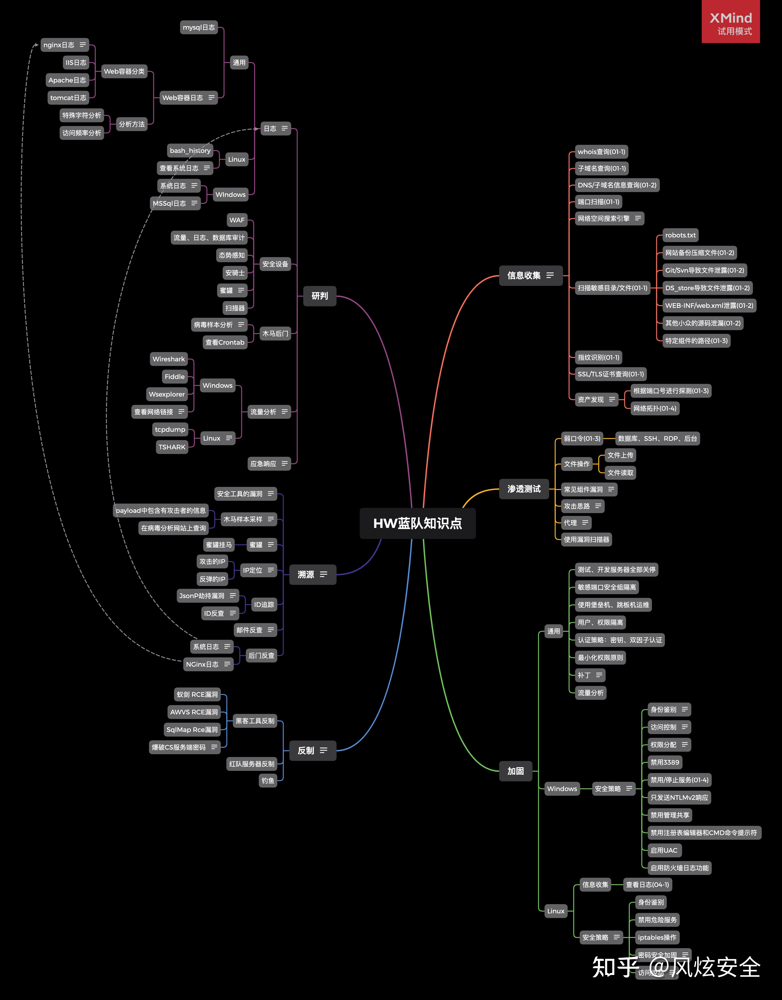

# 网络安全学习资料整理`仍在更新！`

**千万不要忽略实战，不要吝啬知识与工具！**

找一些CTF刷题平台去刷题，比如buuctf、ctfhub、xctf、hetianlab等，网上有各种CTF题目的解题过程，可以去看，去学习。遇到的知识点反过来去补。最终的目的应该是学会某一项的技能，而不是成为赛棍。

CTF比赛知识范围大致分为：Web安全、PWN（二进制安全）、Reverse（逆向破解）、Crypto（密码学安全）、Forensics（数字取证）、Misc（杂项）

## 都要学习的基础！

Linux基础、计算机组成原理，操作系统原理，网络协议分析；

## 攻防

需要能够快速攻击目标主机的权限，考察团队多方面的综合安全能力。

+ [HW-蓝队指导手册](https://zhuanlan.zhihu.com/p/363887711)
+ [HW-红队作战手册](https://zhuanlan.zhihu.com/p/148954500)

**思维导图:**

## Web

[Web工具](./Web/tools.md)

就是给定一个Web网站，选手要根据题目所提示的信息，找到网站上的flag字符串。做题的方法类似于渗透测试，但通常不会是一个完整的渗透测试，而是用到渗透测试中的某一个或某几个环节。可能涉及信息搜集、各类漏洞发现与利用、权限提升等等。 为了获取flag，可能需要拿到管理员权限，数据库权限，甚至获取网站所在服务器的权限。 所需知识： 语言：PHP、Python、JavaScript... 数据库：MySQL、MSSQL... 服务器：Apache、Nginx... Web框架：ThinkPHP、Flask... 语言特性：弱类型、截断... 函数特性：is_numeric、strcmp等

**推荐书籍：**

+ 《白帽子讲Web安全》
+ 《Web应用安全权威指南》

## 逆向(Reverse)

CTF之REVERSE题目涉及到软件逆向、破解技术等，要求有较强的反汇编、反编译扎实功底。需要掌握汇编，堆栈、寄存器方面的知识。有好的逻辑思维能力。主要考查参赛选手的逆向分析能力。 所需知识： 汇编、反汇编、堆栈、调试器、代码分析、OllyDBG、IDA等

**推荐书籍:**

+ 《RE for Beginners（逆向工程入门）》
+ 《IDA Pro权威指南》

## 漏洞挖掘(PWN, Exploit)

PWN在安全领域中指的是通过二进制/系统调用等方式获得目标主机的 shell。CTF 中主要考察二进制漏洞的发掘和利用，需要对计算机操作系统底层 有一定的了解。在 CTF 竞赛中，PWN 题目主要出现在 Linux 平台上。 所需知识： C/C++编程语言基础、编译原理、汇编、反汇编、操作系统、加密与解密、堆栈原理、栈溢出、堆溢出...

## 密码学(Crypto)

CTF之CRYPTO部分题目考察各种加解密技术，包括古典加密技术、现代加密技术甚至出题者自创加密技术。 所需知识： 数学知识、密码编制、密码破解、古典密码、现代密码、密码分析

## 取证(Forensics)

CTF之FORENSICS包括文件格式分析，隐写术，内存转储分析或网络数据包捕获分析，提取静态数据文件中隐藏的信息的任何挑战都可以归为这一类 所需知识： 数据恢复、磁盘取证、内存取证、流量分析、文件隐写

## 移动安全(Mobile)

对安卓和IOS系统的理解，逆向工程等知识。（Windows：.exe     安卓：.APK     Mac：.dmg）

## 杂项(Misc)

就是除上述之外的乱七八糟的网络安全范围内的东西，英文全称为 Miscellaneous，意思是混杂的、各种各样的。MISC 题通 常包括文件分析、图像隐写、数据搜索、内存镜像分析和流量分析等。 题型多样，脑洞大，趣味性强是 MISC 题型的主要特点。 所需知识： 信息隐藏、文件格式、内存镜像、流量分析、数据分析、社会工程等

## 参考

+ [CTF基本赛制与题型](https://www.cnblogs.com/hsp1269/p/13832943.html)
+ [合天网安: ctf小白如何入门？-ctf的学习路线是怎么样的？](https://www.zhihu.com/question/454611713/answer/2416102673)
+ [雾灯: 同上](https://www.zhihu.com/question/454611713/answer/1835040291)